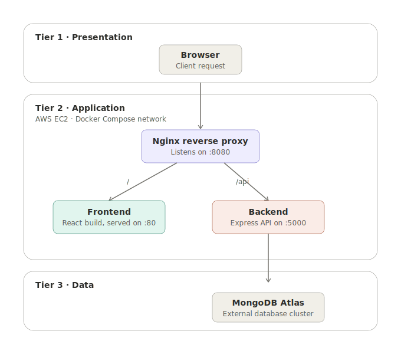
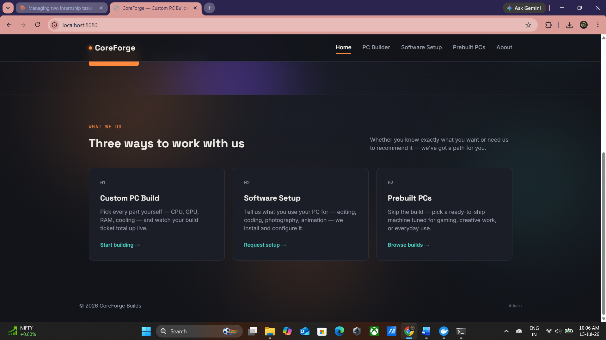
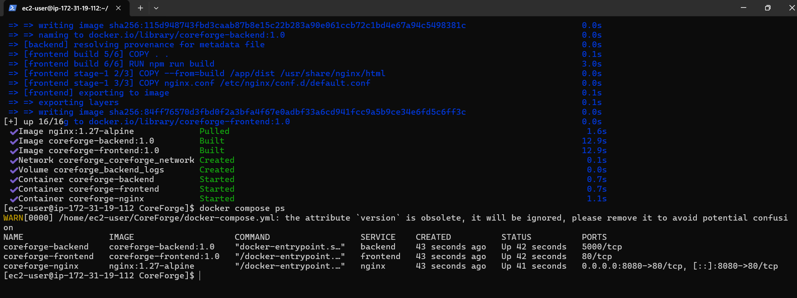
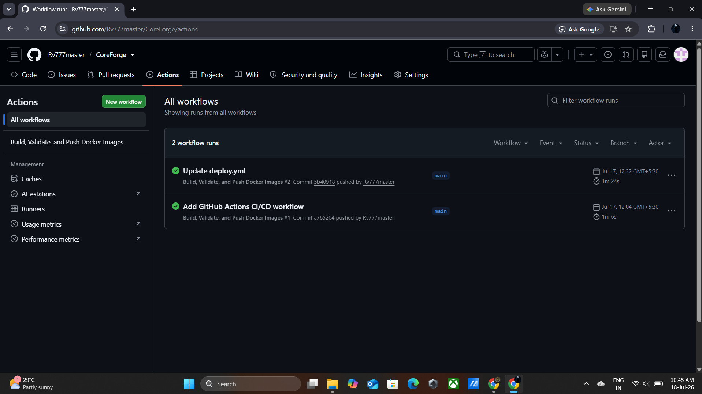
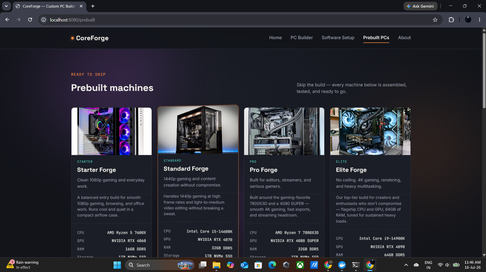

# CoreForge


CoreForge is a full-stack PC building and repair service platform. Customers can configure custom builds, browse prebuilt PCs, request software setup, and submit orders — all backed by a containerized React + Express + MongoDB stack, deployed to AWS with an automated CI/CD pipeline.

This repository was built as the base project for a DevOps internship, covering containerization, CI/CD, cloud deployment, and reverse proxy configuration end to end.

**Live demo:** *coming soon — link will be added here once hosted*

---

## Features

- Custom PC builder — pick components and get a live estimated total
- Prebuilt PC catalog with a "Buy now" order flow
- Software setup request form
- Order notifications sent automatically via email (Nodemailer)
- All orders persisted to MongoDB Atlas
- Fully containerized with Docker Compose — one command to run the whole stack
- Automated CI/CD — every push to `main` builds and validates both Docker images
- Nginx reverse proxy in front of the app, single entry point on port `8080`

---

## Tech stack

| Layer | Technology |
|---|---|
| Frontend | React (Vite) |
| Backend | Express.js, Mongoose |
| Database | MongoDB Atlas |
| Email notifications | Nodemailer (Gmail App Password) |
| Reverse proxy | Nginx |
| Containerization | Docker, Docker Compose |
| CI/CD | GitHub Actions |
| Hosting | AWS EC2 (Amazon Linux 2023) |

---

## Architecture



CoreForge follows a standard three-tier architecture:

- **Tier 1 — Presentation:** the client browser, which talks to a single entry point.
- **Tier 2 — Application:** an AWS EC2 instance running a Docker Compose network with three containers:
  - **Nginx** — reverse proxy, listens on port `8080`, routes by path
  - **Frontend** — the built React app, served internally on port `80`
  - **Backend** — the Express API, running internally on port `5000`
- **Tier 3 — Data:** an external MongoDB Atlas cluster (not containerized), used for persistent storage.

Nginx routes requests based on path: **`/`** goes to the frontend, **`/api`** goes to the backend. Only port `8080` is published to the outside world — the frontend and backend ports are internal-only, reachable exclusively through Nginx. The backend also uses Nodemailer with a Gmail App Password to send order notification emails.

---

## Project structure

```
CoreForge/
├── .github/workflows/       # GitHub Actions CI/CD pipeline
│   └── deploy.yml
├── backend/                 # Express API
│   ├── models/ routes/ utils/
│   ├── server.js
│   ├── Dockerfile
│   └── .env                 # not committed — see Environment variables
├── frontend/                 # React (Vite) app
│   ├── src/ public/
│   ├── nginx.conf            # serves the static build inside the frontend image
│   └── Dockerfile
├── nginx/                    # reverse proxy config (routes / and /api)
│   └── nginx.conf
├── docs/
│   ├── architecture.svg
│   └── screenshots/
├── docker-compose.yml
└── .gitignore
```

---

## API endpoints

| Method | Route | Description |
|---|---|---|
| `GET` | `/api/builds` | List all submitted build/order requests |
| `POST` | `/api/builds` | Submit a new custom build or prebuilt order |

*(Add any additional routes here as the backend grows — check `backend/routes/` for the full list.)*

---

## Environment variables

Neither `.env` file is committed to the repository. Create `backend/.env` with:

```
PORT=5000
MONGO_URI=<your MongoDB Atlas connection string>
EMAIL_USER=<a Gmail address you own>
EMAIL_PASS=<a Gmail App Password — not your normal password>
EMAIL_TO=<where order notifications should be sent>
```

> Note: `MONGO_URI` uses the non-SRV connection string format (listing all three shard hosts explicitly) rather than the standard `mongodb+srv://` format. This was a deliberate choice — the development ISP blocks SRV-record DNS lookups, so the standard connection string fails to resolve. The non-SRV format works identically and requires no other changes.

---

## Running locally

```bash
git clone https://github.com/Rv777master/CoreForge.git
cd CoreForge
# create backend/.env as described above
docker compose up -d --build
```

Visit `http://localhost:8080`.

---

## Docker commands reference

| Command | Purpose |
|---|---|
| `docker compose up -d --build` | Build images and start all containers in the background |
| `docker compose ps` | Check status of all containers |
| `docker compose logs <service>` | View logs for a specific service (`backend`, `frontend`, or `nginx`) |
| `docker compose down` | Stop and remove all containers |
| `docker compose restart <service>` | Restart a single service without rebuilding |
| `docker exec -it coreforge-backend sh` | Open a shell inside the running backend container |

---

## CI/CD pipeline

A GitHub Actions workflow (`.github/workflows/deploy.yml`) runs on every push to `main`. It builds both the frontend and backend Docker images and validates that they build successfully. Actions used (`actions/checkout`, `docker/build-push-action`) are kept on their latest major versions to avoid deprecated-runtime warnings from GitHub.

---

## AWS EC2 deployment

High-level steps to deploy this project to a fresh EC2 instance:

1. Launch an EC2 instance (Amazon Linux 2023, t2.micro/t3.micro — free tier eligible)
2. Open port `22` (SSH, restricted to your IP) and port `8080` (custom TCP, open) in the security group
3. Connect via SSH or EC2 Instance Connect
4. Install Docker: `sudo yum install docker -y && sudo service docker start && sudo systemctl enable docker`
5. Add the user to the Docker group: `sudo usermod -aG docker ec2-user` (log out and back in)
6. Install the Docker Compose and Buildx CLI plugins (Amazon Linux 2023's repos don't include `docker-compose-plugin`, so these are installed manually — see [Common issues](#common-issues--resolutions))
7. Clone the repository and create `backend/.env`
8. Run `docker compose up -d --build`
9. Verify with `docker compose ps` and by visiting `http://<ec2-public-ip>:8080`

---

## Common issues & resolutions

A running log of real problems hit while building and deploying this project, and how each was fixed.

**Missing `frontend/nginx.conf` caused silent Docker build failures**
The frontend Dockerfile's `COPY nginx.conf` step failed silently when the file didn't exist in the build context. Fixed by adding the missing config file to the frontend directory.

**Stale DNS inside the reverse-proxy container**
The Nginx container occasionally resolved old IPs for `frontend`/`backend` after a rebuild. Resolved by ensuring all services share the same Docker Compose bridge network and restarting the `nginx` container after backend/frontend rebuilds.

**Hardcoded `localhost:5000` URLs in the frontend**
Five JSX files called the backend directly via `http://localhost:5000/...`, which broke outside local development. Converted all calls to relative `/api/...` paths, letting Nginx handle routing regardless of environment.

**`pull_policy: build` warning in Docker Compose**
Compose warned that a service had no image to pull. Fixed by explicitly setting `pull_policy: build` in `docker-compose.yml` for locally built services.

**MongoDB SRV connection string failed to resolve**
The standard `mongodb+srv://` format failed due to the development network blocking SRV DNS lookups. Switched to the non-SRV format, listing all shard hosts explicitly in `MONGO_URI`.

**Deprecated GitHub Actions runtime (Node.js 20)**
GitHub flagged `actions/checkout@v4` and `docker/build-push-action@v5` as running on a soon-to-be-deprecated Node.js 20 runtime. Updated both to their current major versions (`checkout@v7`, `build-push-action@v7`).

**EC2 Instance Connect: "Failed to connect to your instance"**
The browser-based SSH terminal failed even with the correct key, because the security group's SSH rule was scoped to `My IP` — which doesn't cover the IP ranges AWS's Instance Connect service connects from. Fixed by either widening the SSH rule temporarily or connecting via a local SSH client instead, where `My IP` scoping works correctly.

**Windows `.pem` file "bad permissions" error**
`ssh -i key.pem ...` refused to use the key with `Permission denied`, because the file's Windows ACL still granted access to the `BUILTIN\Users` group. Fixed with:
```powershell
icacls key.pem /inheritance:r
icacls key.pem /grant:r "%USERNAME%:(R)"
```

**`docker-compose-plugin` not found on Amazon Linux 2023**
`sudo yum install docker-compose-plugin` failed — the package isn't in AL2023's default repos. Installed the Compose binary directly as a CLI plugin instead:
```bash
mkdir -p ~/.docker/cli-plugins
curl -SL https://github.com/docker/compose/releases/latest/download/docker-compose-linux-x86_64 -o ~/.docker/cli-plugins/docker-compose
chmod +x ~/.docker/cli-plugins/docker-compose
```

**`compose build requires buildx 0.17.0 or later`**
The Docker install on a fresh EC2 instance didn't include a recent-enough Buildx. Installed the latest Buildx release as a CLI plugin, resolving the version dynamically rather than hardcoding a tag that might 404:
```bash
BUILDX_VERSION=$(curl -s https://api.github.com/repos/docker/buildx/releases/latest | grep '"tag_name"' | cut -d '"' -f4)
curl -SL https://github.com/docker/buildx/releases/download/${BUILDX_VERSION}/buildx-${BUILDX_VERSION}.linux-amd64 -o ~/.docker/cli-plugins/docker-buildx
chmod +x ~/.docker/cli-plugins/docker-buildx
```

---

## Screenshots

| | |
|---|---|
|  |  |
| Live site homepage | `docker compose ps` — all containers healthy |
|  |  |
| GitHub Actions CI/CD run succeeding | PC Builder in action |

*(Replace the file names above with your actual screenshot files in `docs/screenshots/`. Add or remove rows as needed.)*

---

## Future improvements

- Add HTTPS via a free certificate (Let's Encrypt / Nginx + Certbot, or automatically through Vercel/Render if hosted there)
- Add automated tests to the CI/CD pipeline before building images
- Move to a managed container hosting free tier (Render + Vercel) for a permanent always-on live demo
- Add user authentication for order tracking

---

## Author

**Rudresh Vyas** — [GitHub](https://github.com/Rv777master)
